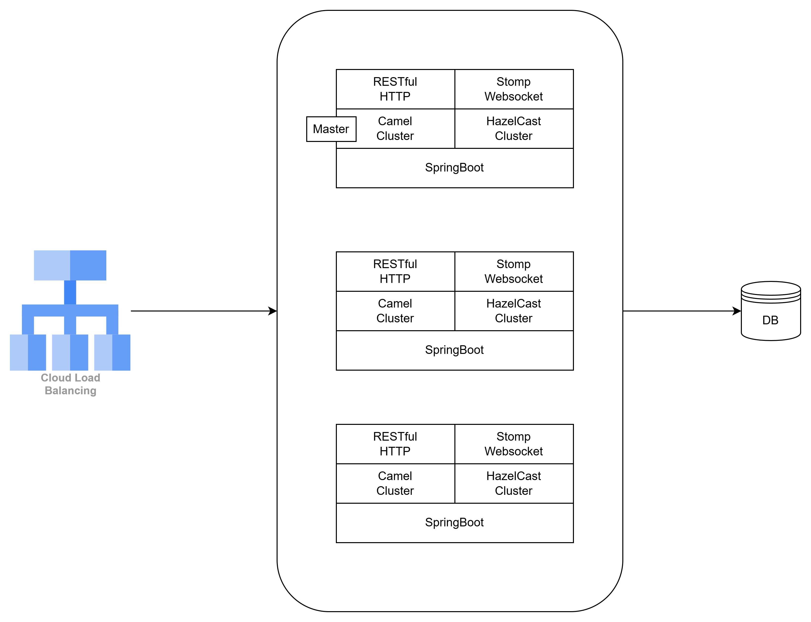

# Chatting Backend Server 
## Overview
- 간단한 채팅 시스템을 구현합니다.
- 사용자는 서버에 접속하여 실시간으로 메시지를 주고 받을 수 있습니다.
- 많은 유저들이 이 서비스를 이용할 수 있도록 부하와 확장을 고려합니다.

## Features
- 실시간 채팅이 가능한 환경을 구성
- 1:1 채팅 및 그룹 채팅을 모두 지원
- 웹, 앱 모두 지원하는 서버를 구성
- 사용자의 접속 상태를 알 수 있어야 함
- 채팅 로그는 반드시 기록

## Restrictions
- 그룹 채팅의 인원은 최대 100명으로 제한.
- 사용자가 전달할 수 있는 메세지는 텍스트만 가능.
- 테스트 메시지의 길이는 1,000자로 제한.
- 암호화는 구현하지 않아도 됩니다만, 구현한다면 어떻게 할 수 있을지 논의해 볼 수 있습니다.
  - 프론트 페이지에서 송/수신 메세지를 암/복호화 담당 합니다.
  - roomId(uuid) 를 private key로 사용 합니다.
  - 암호화 라이브러리는 CryptoJS를 사용 합니다.
  - 프론트 페이지는 WSS(WebSocket Secure)를 사용하여 암호화된 메세지를 서버로 전달한다.
  - 서버에서는 복호화 하지 않습니다.


## Submission
- GitHub public repository 링크.
- 아키텍처 또는 워크플로우를 파악할 수 있는 다이어그램.


## 1. Frameworks And Tools
- JDK 21
- Spring-boot 3.3.5
- Spring-boot-web
- Spring-boot-data-jpa
- Camel
- Hazelcast
- Springdoc-openapi
- H2database
- Lombok

## 2. Test URL
- Api Spec : http://localhost:8080/swagger-ui.html
- Websocket debug tool : https://jiangxy.github.io/websocket-debug-tool/

## 3. Endpoints
- POST /api/v1/chat/room
- GET /api/v1/chat/rooms/member-id/{memberId}
- POST /api/v1/chat/room/join/room-id/{roomId}
- POST /api/v1/chat/room/leave/room-id/{roomId}

## 4. Docker container creation and execution command 

```
docker build -t chat-ws-api:local .  && docker run -p 9090:8080  -e"SPRING_PROFILES_ACTIVE=local"  chat-ws-api:local
docker-compose up
```

## 5. Sequence Table

| Description                   | Method                                       | Remark                                                   |   
|-------------------------------|----------------------------------------------|----------------------------------------------------------|
| 1. 채팅방을 만들고 사용자를 등록한다.        | POST http://chat/room                        |                                                          |
| 2. 사용자가 참여한다.                 | POST http://chat/room/join/room-id/{roomId}  | 최대인원 100명 초과 여부를 확인한다. <br/> 사용자를 접속한 상태로 기록한다. (Active) |
| 2.1 사용자가 등록된 방 목록을 조회 후 참여한다. | GET http://chat/room/member-id/{memberId}    |                                                          |
| 3. 사용자가 입장한다.                 | ws://subscribe, MessageType.ENTER            | 사용자를 접속한 상태로 기록한다. (Active)                              |
| 4. 사용자가 대화를 한다.               | ws://publish , MessageType.TALK              |                                                          |
| 5. 사용자가 퇴장한다.                 | ws://unsubscribe, MessageType.EXIT           | 사용자를 접속하지 않은 상태로 기록한다. (InActive)                        |
| 6. 사용자가 방을 떠난다.               | POST http://chat/room/leave/room-id/{roomId} |                                                          |


## 6. Architecture Diagram
- Chatting Server Architecture Diagram
- 
